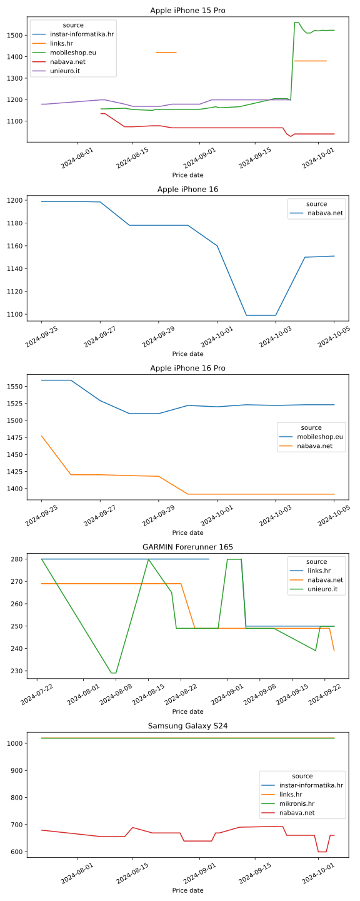

# CI Sample



## Postavljanje za rad

1. [Preuzeti komprimirani projekt](https://github.com/andhrelja/ci-sample/archive/refs/tags/v1.0.2.zip) i dekomprimirati ga na proizvoljno mjesto na računalu (npr. `~/ci-sample`)
2. Navigirati na https://github.com/new i kreirati novi repozitorij s proizvoljnim nazivom (npr. `ci-sample`)
3. Otvoriti terminal u direktoriju projekta i inicijalizirati Git repozitorij naredbom `git init`
4. Postaviti GitHub repozitorij kao `origin` naredbom `git remote add origin https://github.com/<user-name-here>/<repo-name-here>.git`
5. Postaviti `main` kao glavni branch naredbom `git branch -M main`
6. Dodati promjene i napraviti prvi commit: `git add . && git commit -m "build: initial commit"`
7. Pushati promjene na GitHub: `git push origin main`

## Zadaci za početak

1. Napraviti GitHub Workflow naziva `.github/workflows/dispatch.yml`, sadržaja:
    ```yaml
    name: Workflow dispatch

    on:
      workflow_dispatch:

    jobs:
      run:
        name: Hello World
        runs-on: ubuntu-latest
        steps:
        - name: Hello World
          run: echo "Hello World"

    ```
2. Napraviti novi korak naziva "Environment Variables". [Dodati environment varijablu](https://docs.github.com/en/actions/writing-workflows/choosing-what-your-workflow-does/store-information-in-variables) naziva `CURRENT_DATE` i hardcode-irati današnji datum. U `run` sekciji koraka, ispisati:
    - datum pomoću `CURRENT_DATE`
    - datum pomoću Linux `date` [naredbe](https://man7.org/linux/man-pages/man1/date.1.html)
    - datum pomoću odabrane vrijednosti iz [GitHub konteksta](https://docs.github.com/en/actions/writing-workflows/choosing-what-your-workflow-does/accessing-contextual-information-about-workflow-runs#github-context) (**hint**: sljedeći zadatak)
3. Napraviti novi korak naziva "Dump GitHub Context". [Ispisati vrijednosti dostupne u kontekstu](https://docs.github.com/en/actions/writing-workflows/choosing-what-your-workflow-does/accessing-contextual-information-about-workflow-runs#example-printing-context-information-to-the-log).
4. Napraviti novi korak naziva "List Directory Content". U `run` sekciji koraka, ispisati sadržaj direktorija s naredbom `ls -al`.
5. Napraviti novi korak naziva "Checkout Repository" koristeći akciju [actions/checkout](https://github.com/actions/checkout).
6. Napraviti novi korak naziva "List Repository Content". U `run` sekciji koraka, ispisati sadržaj direktorija s naredbom `ls -al`.
7. Napraviti novi korak naziva "List Environment Variables". U `run` sekciji koraka, ispisati environment varijable s naredbom `env`.
8. Napraviti novi korak naziva "List Processes". U `run` sekciji koraka, ispisati procese koji su pokrenuti s naredbom `ps aux`.
9. Napraviti novi korak naziva "Setup Python" koristeći akciju [actions/setup-python](https://github.com/actions/setup-python). Odabrati Python 3.12.
10. Napraviti novi korak naziva "Install Requirements". U `run` sekciji koraka, [instalirati](https://pip.pypa.io/en/stable/cli/pip_install/) `requirements.txt` koristeći `pip`.
11. Napraviti novi korak naziva "Generate Report". U `run` sekciji koraka, pokrenuti Python skriptu `run-report.py`.

## Sljedeći koraci

Nakon generiranja izvješća u koraku "Generate Report", je li ono ostalo dostupno na repozitoriju?

## Zadaci za nastavak

1. Napraviti GitHub Workflow naziva `.github/workflows/schedule.yml`, sadržaja:
    ```yaml
    name: Scheduled Scraper

    on:
      workflow_dispatch:
      # schedule:

    jobs:
      run:
        name: "Run price_scraper"
        runs-on: ubuntu-latest
        steps:
        - name: Checkout Repository
          uses: actions/checkout@v4

        - name: Setup Python
          uses: actions/setup-python@v4
          with:
            python-version: '3.12'
            
        - name: Install price_scraper
          run: pip install git+https://github.com/andhrelja/price_scraper
    ```
2. Proći kroz dokumentaciju paketa: [https://github.com/andhrelja/price_scraper](https://github.com/andhrelja/price_scraper)
3. Napraviti novi korak naziva "Run price_scraper". Konfigurirati ulaze i izlaze za paket te pokrenuti skriptu
4. Napraviti novi korak naziva "Generate Report". U `run` sekciji koraka, pokrenuti Python skriptu `run-report.py`.
5. Napraviti novi korak naziva "Commit Changes".
6. Napraviti novi korak naziva "Push Changes", koristeći [ad-m/github-push-action](https://github.com/ad-m/github-push-action) (**hint**: dopustiti workflow-u ovlast "Write" nad GitHub repozitorijem).
7. Konfigurirati `schedule` workflow-a tako da se on pokreće svaki dan u 00:00 UTC.